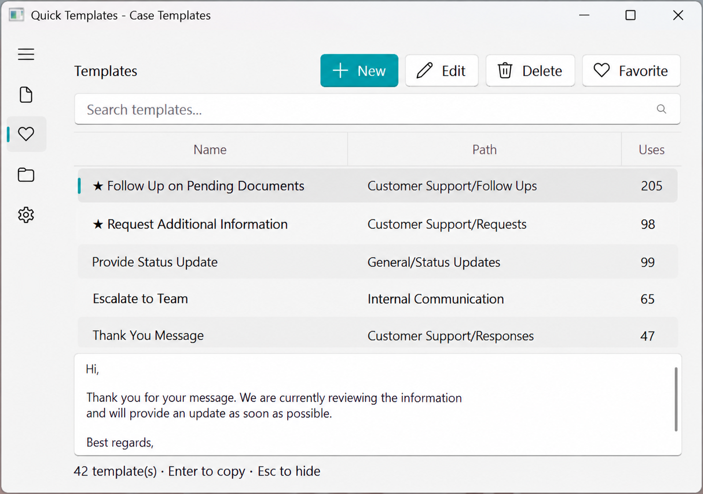
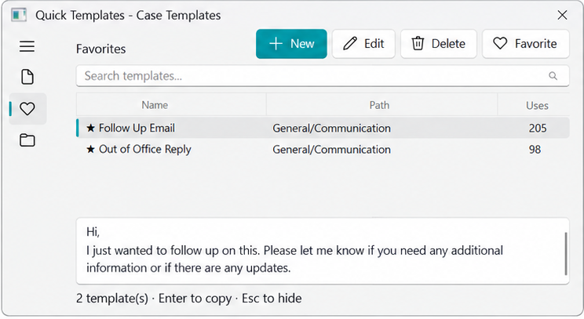
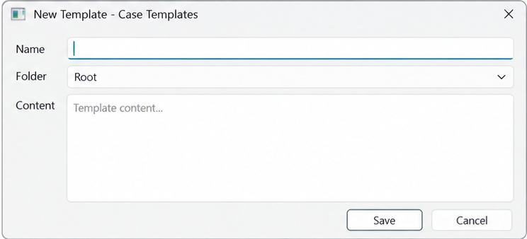
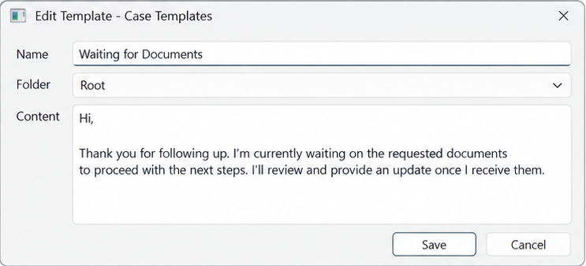
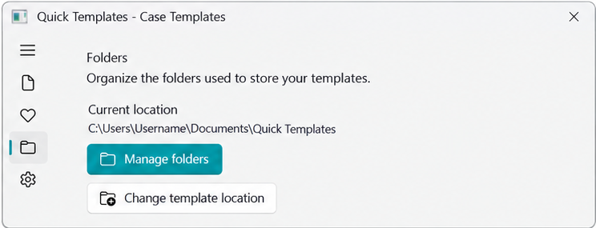
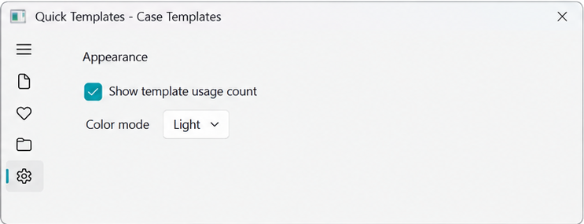

# Quick Templates

Quick Templates is a Windows desktop application for creating, organizing, and quickly copying reusable text templates.

Keep frequently used text in a searchable local library. Organize templates into folders, mark favorites, preview content, and copy it directly to the clipboard.

## Install

Open PowerShell and run:

```powershell
irm https://raw.githubusercontent.com/robert-viquez/quick.templates/main/install.ps1 | iex
```

## Features

- Create, edit, search, and organize templates
- Copy the selected template with Enter
- Favorites and usage counters
- Light, dark, and system themes
- Local Markdown storage in a configurable folder
- Optional backup through a synchronized folder such as OneDrive

## Screenshots

| Screenshot | Details | Screenshot | Details |
| --- | --- | --- | --- |
|  | Search and preview templates. |  | Access frequently used templates. |
|  | Create a template. |  | Update existing content. |
|  | Organize the library. |  | Configure appearance and usage counts. |

## Documentation

- [Usage and configuration](docs/USAGE.md)
- [Contributing](CONTRIBUTING.md)

Issues and pull requests are welcome.

## License

MIT
